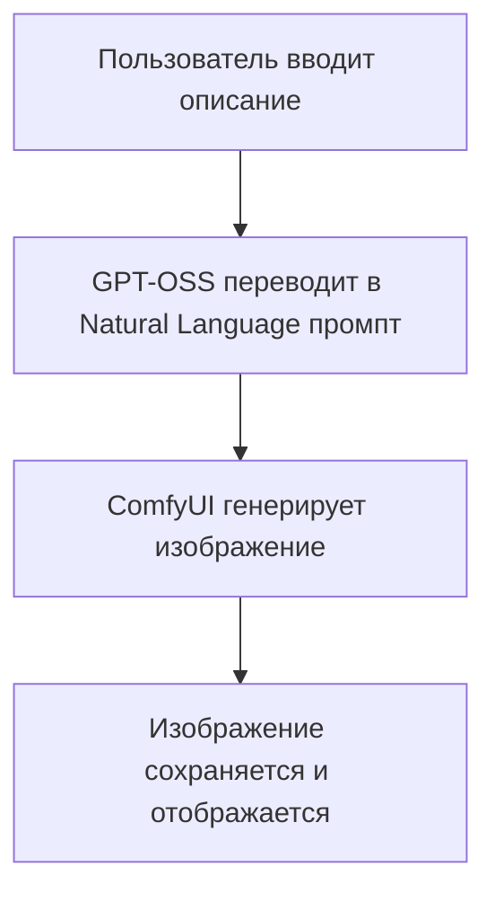
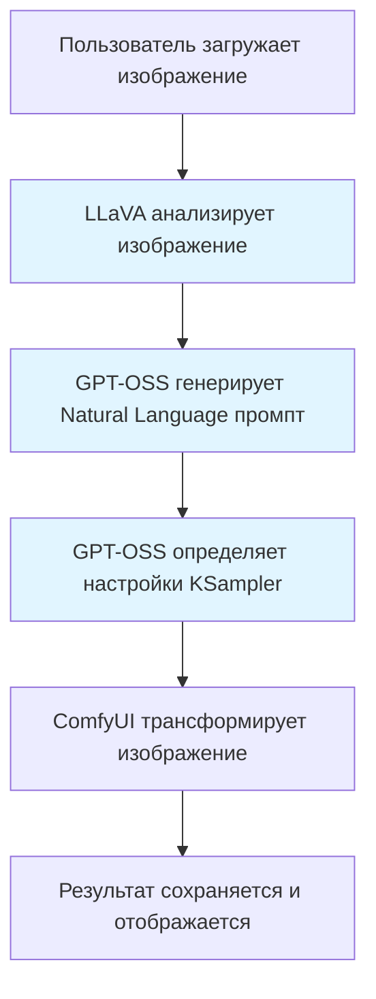
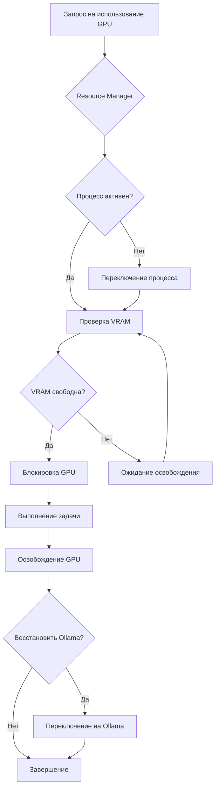
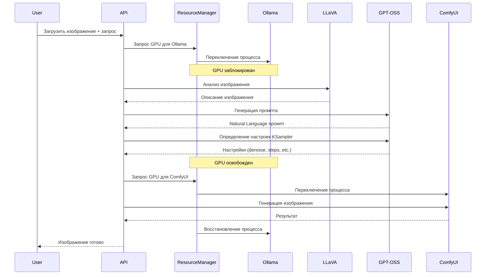

# Ollama Chat

Современное веб-приложение для общения с локальными LLM моделями через Ollama. Полнофункциональный чат с системой авторизации, управлением чатами, генерацией изображений и интеллектуальным анализом.

## 🚀 Возможности

- 💬 **Чат с LLM моделями** - Общение с любыми моделями Ollama в реальном времени
- 🔍 **Поиск в интернете** - Интеграция с Tavily API для получения актуальной информации
- 🎨 **Генерация изображений** - Создание изображений через ComfyUI на основе текстовых описаний
- 🖼️ **Image-to-Image трансформация** - Модификация загруженных изображений с помощью Flux.1-dev
- 👁️ **Визуальный анализ изображений** - Автоматический анализ загруженных изображений через LLaVA
- 🔄 **Batch генерация** - Создание нескольких вариантов изображения с разными seed
- 🎯 **Natural Language промпты** - Оптимизированные промпты для Flux.1-dev
- 🔐 **Система авторизации** - Регистрация, вход, управление профилем
- 📝 **Управление чатами** - Создание, переименование, закрепление и удаление чатов
- ✏️ **Редактирование сообщений** - Возможность редактировать и удалять сообщения
- 👥 **Административная панель** - Управление пользователями и ролями
- 🎨 **Современный UI** - Адаптивный интерфейс с поддержкой Markdown
- 🔒 **Безопасность** - JWT аутентификация, хеширование паролей (bcrypt)
- 📱 **Адаптивный дизайн** - Работает на десктопе и мобильных устройствах
- 🖥️ **GPU Resource Management** - Умное управление GPU ресурсами между Ollama и ComfyUI
- 🔄 **Process Management** - Автоматическое переключение между Ollama и ComfyUI с защитой активных процессов

## 📋 Требования

- Python 3.8+
- Node.js 16+
- Ollama (установленный и запущенный локально)
- ComfyUI (для генерации изображений)
- MySQL (для базы данных) или SQLite
- NVIDIA GPU (рекомендуется для генерации изображений)
- Process Manager (опционально, для автоматического переключения процессов)

## 🛠️ Установка

### Быстрый старт

1. Клонируйте репозиторий:
```bash
git clone <repository-url>
cd GPTChat
```

2. Запустите проект одной командой:
```bash
start.bat
```

Скрипт автоматически запустит бэкенд и фронтенд в отдельных окнах.

### Ручная установка

#### Бэкенд

```bash
cd backend

# Создание виртуального окружения
python -m venv venv

# Активация окружения (Windows PowerShell)
.\venv\Scripts\Activate.ps1

# Активация окружения (Windows CMD)
venv\Scripts\activate.bat

# Активация окружения (Linux/Mac)
source venv/bin/activate

# Установка зависимостей
pip install -r requirements.txt

# Настройка переменных окружения
cp .env.example .env
# Отредактируйте .env и установите JWT_SECRET

# Запуск сервера
python run.py
```

Бэкенд будет доступен на `http://localhost:5000`

#### Фронтенд

```bash
cd frontend

# Установка зависимостей
npm install

# Настройка переменных окружения (опционально)
cp .env.example .env
# Отредактируйте .env если нужно изменить URL API

# Запуск приложения
npm start
```

Фронтенд будет доступен на `http://localhost:3000`

## 📁 Структура проекта

```
GPTChat/
├── backend/                 # Python FastAPI бэкенд
│   ├── app/
│   │   ├── main.py         # Точка входа FastAPI
│   │   ├── config.py       # Конфигурация приложения
│   │   ├── database.py     # Подключение к БД
│   │   ├── models/         # SQLAlchemy модели (User, Chat, Message)
│   │   ├── routes/         # API маршруты
│   │   │   ├── auth.py     # Аутентификация
│   │   │   ├── chats.py    # Управление чатами
│   │   │   ├── admin.py    # Админ панель
│   │   │   ├── search_chat.py  # Чат с поиском
│   │   │   ├── image_generation.py  # Генерация изображений
│   │   │   └── process.py  # Управление процессами (Ollama/ComfyUI)
│   │   ├── schemas/        # Pydantic схемы
│   │   ├── services/       # Бизнес-логика
│   │   │   ├── search_service.py      # Сервис поиска (Tavily)
│   │   │   ├── comfyui_service.py     # Сервис ComfyUI
│   │   │   ├── prompt_service.py      # Сервис перевода промптов и анализа
│   │   │   ├── resource_manager.py    # Управление GPU ресурсами
│   │   │   ├── process_manager_service.py  # Управление процессами через Process Manager API
│   │   │   ├── vram_monitor.py        # Мониторинг VRAM
│   │   │   └── service_types.py      # Типы сервисов (Ollama/ComfyUI)
│   │   ├── auth/           # JWT аутентификация
│   │   └── utils/          # Утилиты
│   │       ├── image_storage.py  # Хранение изображений
│   │       └── add_edit_delete_fields_to_messages.py  # Миграции БД
│   ├── static/             # Статические файлы
│   │   └── images/         # Сгенерированные изображения
│   ├── requirements.txt    # Python зависимости
│   └── run.py              # Скрипт запуска
├── frontend/               # React фронтенд
│   ├── src/
│   │   ├── components/     # React компоненты
│   │   ├── App.js          # Главный компонент
│   │   └── AuthContext.js  # Контекст авторизации
│   └── package.json        # Node.js зависимости
├── process_manager/        # Process Manager для переключения процессов
├── start.bat               # Скрипт запуска всего проекта
├── AUDIT_IMG_TO_IMG.md     # Аудит функционала генерации изображений
├── TROUBLESHOOTING.md      # Руководство по решению проблем
└── README.md
```

## 🎨 Генерация изображений

Приложение поддерживает два режима генерации изображений через ComfyUI:

### 1. Text-to-Image (Текст в изображение)

Создание изображения на основе текстового описания на русском языке.

#### Как это работает:



**Процесс:**
1. Пользователь вводит описание на русском языке
2. Локальная LLM (GPT-OSS через Ollama) переводит описание в качественный Natural Language промпт для Flux.1-dev
3. ComfyUI генерирует изображение используя модель Flux.1-dev
4. Изображение сохраняется локально и отображается в чате

### 2. Image-to-Image (Изображение в изображение)

Трансформация загруженного изображения на основе текстового описания.

#### Как это работает:



**Детальный процесс:**

1. **Загрузка изображения**
   - Пользователь загружает изображение через интерфейс
   - Изображение валидируется и сжимается до 1024px (если больше)
   - Изображение сохраняется в базе данных

2. **Визуальный анализ (LLaVA)**
   - LLaVA (через Ollama) анализирует изображение
   - Генерируется детальное описание на английском языке:
     - Цвета всех объектов
     - Материалы и текстуры
     - Композиция и расположение
     - Освещение и стиль
   - Описание используется для контекста при генерации промпта

3. **Генерация промпта (GPT-OSS)**
   - GPT-OSS получает:
     - Описание текущего изображения от LLaVA
     - Запрос пользователя на русском языке
   - Генерирует Natural Language промпт для Flux.1-dev:
     - Полные предложения вместо tag-based промптов
     - Фокус на желаемом результате
     - Без "junk words" (photorealistic, 8k, masterpiece)
     - Negative prompt всегда пустой (Flux.1-dev не использует его)

4. **Определение настроек KSampler (GPT-OSS)**
   - GPT-OSS анализирует запрос и определяет оптимальные настройки:
     - **Denoise**: 0.55-0.65 для цветовых изменений (оптимально для Flux.1-dev)
     - **Steps**: 25-30
     - **CFG**: 1.0 (фиксированно для Flux)
     - **Sampler**: euler (рекомендуется для img-to-img)

5. **Генерация в ComfyUI**
   - Загружается исходное изображение в ComfyUI
   - Применяются настройки KSampler
   - Используется Natural Language промпт
   - Генерируется трансформированное изображение

6. **Сохранение результата**
   - Изображение сохраняется локально
   - Метаданные сохраняются в БД:
     - Промпты (positive и negative)
     - Настройки KSampler
     - Seed для воспроизводимости
     - Описание от LLaVA
     - Размеры изображения

### Особенности Flux.1-dev

- **Natural Language промпты**: Flux.1-dev понимает полные предложения, а не списки ключевых слов
- **Оптимальный denoise**: 0.55-0.65 для трансформаций (выше разрушает структуру)
- **Без negative prompt**: Flux.1-dev не использует negative conditioning
- **Качество через основной промпт**: Все качество контролируется через positive промпт

### Batch Processing

Поддержка генерации нескольких вариантов изображения:

- Параметр `batch_count` (1-4 варианта)
- Каждый вариант использует случайный seed
- Все варианты сохраняются в БД с метаданными
- Позволяет выбрать лучший результат

## 🖥️ GPU Resource Management

Система умного управления GPU ресурсами для оптимального использования между Ollama и ComfyUI.

### Архитектура управления ресурсами:



### Компоненты:

1. **Resource Manager** (`resource_manager.py`)
   - Управление очередью запросов на GPU
   - Приоритизация задач (ComfyUI > Ollama)
   - Блокировка и освобождение ресурсов
   - Автоматическое восстановление Ollama после ComfyUI

2. **Process Manager Service** (`process_manager_service.py`)
   - Переключение между процессами (Ollama ↔ ComfyUI)
   - Проверка готовности процессов
   - Таймауты и retry логика

3. **VRAM Monitor** (`vram_monitor.py`)
   - Мониторинг использования VRAM
   - Проверка доступности GPU
   - Предупреждения при высоком использовании

### Оптимизация запросов к Ollama

Для img-to-img генерации все запросы к Ollama группируются:



## 🔧 Конфигурация

### Бэкенд (.env)

```env
# JWT и безопасность
JWT_SECRET=your-secret-key-here

# База данных (MySQL)
DB_HOST=localhost
DB_PORT=3306
DB_USER=root
DB_PASSWORD=your-password
DB_NAME=ollama_chat
DB_USE_MYSQL=true

# Ollama
OLLAMA_URL=http://localhost:11434
OLLAMA_DEFAULT_MODEL=gpt-oss:20b
OLLAMA_VISION_MODEL=llava:13b
OLLAMA_VISION_TIMEOUT=30

# Tavily Search API (опционально)
TAVILY_API_KEY=your-tavily-api-key

# ComfyUI (для генерации изображений)
COMFYUI_URL=http://your-comfyui-server:8188
COMFYUI_MODEL=flux1-dev-fp8
COMFYUI_TIMEOUT=300
COMFYUI_WORKFLOW_PATH=C:/ComfyUI_windows_portable/ComfyUI/Flux.json
COMFYUI_WORKFLOW_IMG2IMG_PATH=C:/ComfyUI_windows_portable/ComfyUI/Flux-img-to-img.json

# Хранение изображений
IMAGE_STORAGE_PATH=static/images
IMAGE_DEFAULT_WIDTH=1024
IMAGE_DEFAULT_HEIGHT=1024
IMAGE_MAX_WIDTH_UPLOAD=4096
IMAGE_MAX_HEIGHT_UPLOAD=4096
IMAGE_MAX_SIZE_FOR_GENERATION=1024

# GPU Resource Management
GPU_MONITOR_ENABLED=true
GPU_MONITOR_INTERVAL=2
GPU_VRAM_THRESHOLD=90
GPU_MIN_FREE_VRAM_MB=1024
GPU_WAIT_TIMEOUT=300
GPU_PRIORITY_COMFYUI=10
GPU_PRIORITY_OLLAMA=5
GPU_ALWAYS_RESTORE_OLLAMA_AFTER_COMFYUI=true

# Process Management API
PROCESS_MANAGER_API_URL=http://localhost:8888
PROCESS_SWITCH_TIMEOUT=30
PROCESS_STARTUP_WAIT=10
PROCESS_RESTORE_ON_RELEASE=true
```

### Фронтенд (.env)

```env
REACT_APP_API_URL=http://localhost:5000
```

## 📚 API Документация

После запуска бэкенда доступна автоматическая документация:

- **Swagger UI**: http://localhost:5000/docs
- **ReDoc**: http://localhost:5000/redoc

### Основные эндпоинты

**Аутентификация:**
- `POST /api/auth/register` - Регистрация нового пользователя
- `POST /api/auth/login` - Вход в систему
- `GET /api/auth/verify` - Проверка токена

**Чаты:**
- `GET /api/chats` - Список чатов пользователя
- `POST /api/chats` - Создание нового чата
- `GET /api/chats/{id}` - Получение чата с сообщениями
- `PUT /api/chats/{id}` - Обновление чата
- `DELETE /api/chats/{id}` - Удаление чата

**Сообщения:**
- `PUT /api/chats/{chat_id}/messages/{message_id}` - Редактирование сообщения
- `DELETE /api/chats/{chat_id}/messages/{message_id}` - Удаление сообщения

**Чат с поиском:**
- `POST /api/chat/search` - Отправка сообщения с поиском в интернете

**Генерация изображений:**
- `POST /api/image/upload` - Загрузка изображения для img-to-img
- `POST /api/image/generate` - Генерация изображения (text-to-image или img-to-img)
- `POST /api/image/generate/stream` - Потоковая генерация изображения
- `GET /api/image/{message_id}` - Получение метаданных изображения

**Управление процессами:**
- `POST /api/process/switch?service={ollama|comfyui}` - Переключение между Ollama и ComfyUI
- `GET /api/process/status` - Получение статуса процессов (Ollama/ComfyUI)

### Параметры генерации изображений

**POST /api/image/generate**

```json
{
  "chat_id": 1,
  "description": "Сделать забор белым",
  "width": 1024,
  "height": 1024,
  "reference_image_id": 123,
  "batch_count": 1
}
```

- `chat_id` (required) - ID чата
- `description` (required) - Описание на русском языке
- `width` (optional) - Ширина изображения (для text-to-image)
- `height` (optional) - Высота изображения (для text-to-image)
- `reference_image_id` (optional) - ID сообщения с изображением (для img-to-img)
- `batch_count` (optional, 1-4) - Количество вариантов для генерации

## 🧪 Технологии

### Backend
- **FastAPI** - Современный веб-фреймворк для Python
- **SQLAlchemy** - ORM для работы с базой данных
- **MySQL** - Реляционная база данных
- **JWT** - JSON Web Tokens для аутентификации
- **Bcrypt** - Хеширование паролей
- **Pydantic** - Валидация данных
- **Tavily API** - Поиск в интернете
- **ComfyUI API** - Генерация изображений через Flux.1-dev
- **Ollama** - Локальные LLM модели (GPT-OSS, LLaVA)
- **Pillow** - Обработка изображений
- **pynvml** - Мониторинг GPU

### Frontend
- **React** - JavaScript библиотека для UI
- **React Markdown** - Рендеринг Markdown
- **React Icons** - Иконки

## 🎯 Использование

### Генерация изображения из текста

1. Откройте чат
2. Нажмите на кнопку "Create image" в меню плюса
3. Введите описание изображения на русском языке
4. Выберите размер (опционально)
5. Нажмите "Generate"
6. Дождитесь завершения генерации (обычно 30-120 секунд)
7. Изображение появится в чате

### Трансформация изображения

1. Откройте чат
2. Нажмите на кнопку "Create image" в меню плюса
3. Загрузите изображение (drag & drop или кнопка "+")
4. Введите описание желаемых изменений на русском языке
5. Нажмите "Generate"
6. Система автоматически:
   - Проанализирует изображение через LLaVA
   - Сгенерирует Natural Language промпт
   - Определит оптимальные настройки
   - Трансформирует изображение
7. Результат появится в чате

### Batch генерация

1. При генерации изображения укажите `batch_count` (1-4)
2. Система создаст несколько вариантов с разными seed
3. Все варианты будут сохранены в чате
4. Выберите лучший результат

## 🔐 Безопасность

- Пароли хешируются с помощью bcrypt
- JWT токены для аутентификации
- Защита от SQL-инъекций через SQLAlchemy ORM
- CORS настройки для безопасности
- Валидация входных данных (Pydantic)
- Проверка прав доступа к ресурсам
- Валидация изображений перед обработкой

## 📊 Производительность

- Автоматическое сжатие изображений до 1024px для ускорения генерации
- Группировка запросов к Ollama для минимизации переключений процессов
- Оптимизированные настройки для Flux.1-dev
- Кэширование описаний изображений (в метаданных)
- Защита от переключения на Ollama при активном ComfyUI
- Автоматическое переключение на Ollama при отправке текстовых сообщений

## 🐛 Решение проблем

См. [TROUBLESHOOTING.md](TROUBLESHOOTING.md) для решения распространенных проблем.

## 📝 Лицензия

MIT License

## 🤝 Вклад

Приветствуются любые улучшения! Создавайте issues и pull requests.

## 📞 Поддержка

Если у вас возникли вопросы или проблемы, создайте issue в репозитории.
